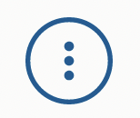

# Create a Terra account

AnVIL uses [Terra](https://anvil.terra.bio/) to run analyses. Terra operates on Google Cloud Platform, so you’ll need a (free) Google account in order to use AnVIL. 

## Create a Google Account


If you do not already have a Google account that you would like to use for accessing Terra, [create one now](https://accounts.google.com/SignUp). Otherwise, please use a Gmail account you have already set up.

If you would like to create a Google account that is associated with your non-Gmail, institutional email address, follow [these instructions](https://support.terra.bio/hc/en-us/articles/360029186611).

## Sign in to Terra

You need to sign into Terra with your Google account to allow your instructor to add you to projects and/or Workspaces associated with your specific class. This is the only way you can launch applications and perform computations on AnVIL. [Launch Terra](https://anvil.terra.bio/) and you should be prompted to sign in with your Google account.

::: {.warning}
**Collect Accounts**: It is _very important_ that you share the Google account you used above with with your instructor! Otherwise, the instructor cannot add you to billing projects or Workspaces, and you will be unable to proceed with your assignments.
:::

You can always access Terra by going to [`anvil.terra.bio`](https://anvil.terra.bio/), or by clicking the link on the AnVIL home page.


# Cloning a workspace {#workspace}

In the next few steps, you will walk through how to get started on the AnVIL platform. AnVIL is centered around different “Workspaces”. Each Workspace functions almost like a mini code laboratory - it is a place where data can be examined, stored, and analyzed. The first thing we want to do is to copy or “clone” a Workspace to create a space for you to experiment.

Use a web browser to go to the AnVIL website. In the browser type:

```
anvil.terra.bio
```

:::{.notice}
**Tip**
At this point, it might make things easier to open up a new window in your browser and split your screen. That way, you can follow along with this guide on one side and execute the steps on the other.
:::

After logging in, click “View Workspaces”. Select the “Public” tab. In the top search bar type the activity workspace “SARS-CoV-2-Genome”. You can also go directly to the following link: https://anvil.terra.bio/#workspaces/gdscn-exercises/SARS-CoV-2-Genome. 

Clone the workspace by clicking the teardrop button ({#id .class width=25 height=20px}). And selecting “Clone”.


In the first box, give your Workspace clone a name by adding an underscore (“_”) and your name. For example, “SARS-CoV-2-Genome_Ava_Hoffman”. Next, select the Billing project provided by your instructor. Leave the bottom two boxes as-is and click “CLONE WORKSPACE”.


